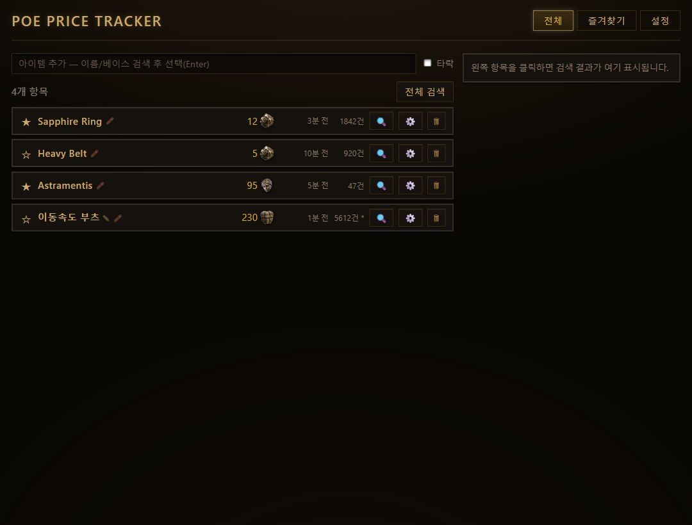
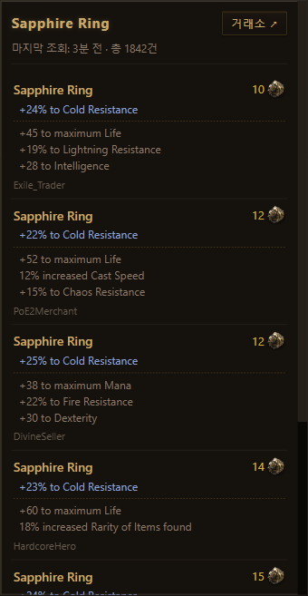
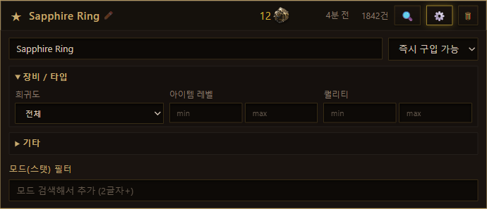
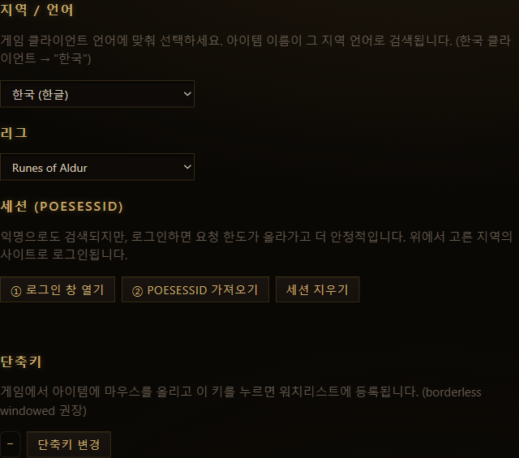

# PoE Price Tracker

개인용 **Path of Exile** 아이템 가격 추적 데스크톱 앱 (현재 PoE2 우선, PoE1 추후 지원).

워치리스트에 담은 항목을 비공식 `trade2` API로 조회해 **가격을 한 줄로** 보여주고, 일시·가격 히스토리를 로컬에 저장합니다. 인게임에서 **마우스오버 + 단축키**로 아이템을 빠르게 등록하고, 항목별로 거래소처럼 **세부 검색조건**을 편집할 수 있습니다. 모든 요청은 **사용자 본인 PC(본인 IP·세션)에서 직접** 나가며 중앙 서버를 두지 않습니다.

> ⚠️ This product isn't affiliated with or endorsed by Grinding Gear Games in any way.

---

## 스크린샷

| 메인 (워치리스트) | 검색 결과 패널 |
| --- | --- |
|  |  |

| 검색조건 편집 | 설정 (지역/리그/세션/단축키) |
| --- | --- |
|  |  |

---

## 주요 기능

- **워치리스트** — 추적할 아이템을 한 줄씩 등록. 별표로 즐겨찾기, `전체`/`즐겨찾기` 탭 분리.
- **가격 조회** — 항목별 🔍 버튼 또는 `전체 검색`. `search → fetch` 2단계로 최저가 표본의 **중앙값**과 개별 시세를 가져옵니다.
- **결과 패널** — 우측에 개별 시세를 거래소처럼 표시: 아이템 이름 + **통화 아이콘**(호버 시 한글명) + **고정옵션(implicit) / 일반옵션(explicit)을 점선으로 구분** + 판매 계정. `거래소 ↗`로 공식 웹 거래소를 브라우저에서 엽니다.
- **인게임 캡처** — 게임에서 아이템에 마우스를 올리고 단축키(기본 `F7`)를 누르면 워치리스트에 자동 등록 (합성 `Ctrl+C` → 클립보드 파싱).
- **세부 검색조건** — `data/filters` 스키마 기반 동적 필터 빌더(아코디언). 상태(즉시구입 등), 희귀도/타락, 모드(스탯) 필터를 거래소처럼 편집.
- **아이템 자동완성** — `data/items`로 유니크/베이스를 정확 매칭해 잘못된 이름으로 인한 400 오류 방지.
- **검색명 편집** — 행 이름을 더블클릭 또는 ✏️로 직접 변경(비우면 검색 내용 기반 자동 이름으로 복귀).
- **지역/언어** — 한국(`poe.game.daum.net`, 기본) · 글로벌 · 대만 · 일본 · 러시아 realm 선택. 아이템 이름이 해당 지역 언어로 검색됩니다.
- **가격 히스토리** — 조회 시점·가격을 `localStorage`에 저장, 상대시간("3분 전")은 1분마다 자동 갱신.
- **레이트리밋 보호** — 서버 응답 헤더를 읽어 자동 스로틀(아래 [안전장치](#레이트리밋--안전장치) 참고).

---

## 핵심 원칙

- 모든 `trade2` 요청은 **사용자 본인 클라이언트(IP/세션)에서** 직접 — 중앙 서버 없음(공유 IP 레이트리밋 회피).
- GGG ToS 준수 지향: 수동 1키 = 1액션, **게임 클라이언트 메모리 미접촉**(클립보드만 사용), 레이트리밋 헤더 준수.

---

## 기술 스택

- **Tauri 2** — Rust 백엔드 + 시스템 웹뷰 UI
- **프론트엔드** — React 19 + TypeScript + Vite
- **HTTP** — Rust `reqwest`(native-tls) — 브라우저 CORS 무관
- **글로벌 핫키** — `tauri-plugin-global-shortcut`
- **클립보드** — `tauri-plugin-clipboard-manager`
- **외부 링크** — `tauri-plugin-opener`
- **키 입력 모사** — `enigo`(합성 `Ctrl+C`)

---

## 시작하기

### 요구 사항

- [Node.js](https://nodejs.org/) 18+
- [Rust](https://www.rust-lang.org/tools/install) (stable) + 플랫폼별 Tauri 사전 요구사항 → [Tauri 가이드](https://tauri.app/start/prerequisites/)

### 설치

```bash
npm install
```

### 개발 실행

```bash
npm run tauri dev
```

> 최초 실행 시 Rust 백엔드 컴파일에 수 분 걸릴 수 있습니다.

### 프로덕션 빌드

```bash
npm run tauri build
```

### 테스트

```bash
npm run test                         # 프론트엔드 단위 테스트 (vitest)
cargo test --lib --manifest-path src-tauri/Cargo.toml   # Rust 단위 테스트
# 라이브 통합 테스트(실제 API 호출):
cargo test --manifest-path src-tauri/Cargo.toml -- --ignored --nocapture
```

---

## 사용법

1. **지역 선택** — `설정` 탭 → 게임 클라이언트 언어에 맞춰 지역을 고릅니다(한국 클라이언트 → "한국"). 아이템 이름이 그 지역 언어로 검색됩니다.
2. **(선택) 로그인** — `설정`에서 `① 로그인 창 열기` → 로그인 → `② POESESSID 가져오기`. 익명으로도 검색되지만 로그인하면 요청 한도가 올라가고 안정적입니다.
3. **항목 추가** — 상단 검색창에 이름/베이스를 입력해 자동완성에서 선택(Enter), 또는 게임에서 단축키로 캡처.
4. **검색** — 행의 🔍(개별) 또는 `전체 검색`. 결과가 우측 패널에 표시됩니다.
5. **세부 조건** — 행의 ⚙️로 검색조건(상태·희귀도·타락·모드 필터)을 편집.
6. **이름 변경** — 행 이름을 더블클릭 또는 ✏️.

### 기본 단축키

| 동작 | 키 | 비고 |
| --- | --- | --- |
| 인게임 아이템 캡처 | `F7` | `설정`에서 재바인딩 가능. **borderless windowed** 권장 |

---

## 레이트리밋 / 안전장치

`trade2`는 IP/계정별로 엄격한 슬라이딩 윈도우 한도를 둡니다(예: search 5회/10초, 15회/60초, **30회/300초 → 위반 시 30분 락**). 이 앱은:

- 모든 요청을 **단일 직렬 큐**(동시성 1)로 보내고, 응답의 `X-Rate-Limit-*` 헤더로 한도를 재구성해 자동 대기합니다.
- 전역 최소 간격(1.5초)·정책별 토큰 버킷·`429 Retry-After` 동결을 적용합니다.
- 가격 1건 = `search` + `fetch` 2콜. `전체 검색`은 항목을 순차 처리합니다.

---

## 데이터 저장

- **워치리스트 / 리그 / 캐시**는 브라우저 `localStorage`에 저장됩니다(`poe-watchlist.v1`, `poe-league.v1`, `poe-items.v1`, `poe-static.v1` 등).
- **POESESSID**는 앱 로컬 데이터 디렉터리에 평문으로 저장됩니다(로컬 전용).

---

## 프로젝트 구조

```
src/                        프론트엔드 (React + TS)
  App.tsx                   메인 셸 (탭 · 2-pane 레이아웃 · 통화맵/타이머)
  App.css                   PoE 거래소 톤 다크 테마
  components/               UI 컴포넌트
    WatchRow / ResultPanel / AddItem / FilterBuilder /
    ItemSearch / StatPicker / Settings / CurrencyAmount
  lib/                      타입 · API 래퍼 · 쿼리 빌더 · 저장소 · 캐시
src-tauri/src/              백엔드 (Rust)
  trade/                    trade2 클라이언트 · 레이트리밋 · 모델 · 커맨드
  item.rs                   클립보드 아이템 파서
  session.rs                임베디드 로그인 · POESESSID 캡처 · 지역 호스트
  hotkey.rs                 글로벌 핫키 → 합성 Ctrl+C → 캡처
docs/DESIGN.md              설계 문서
```

### 주요 Tauri 커맨드

`get_leagues` · `get_stats` · `get_filters` · `get_items` · `get_static` · `price_check` · `set_poesessid` · `open_login` · `capture_poesessid` · `set_trade_host` · `open_in_browser` · `parse_item_text` · `set_capture_hotkey`

---

## 제한 / 주의

- 비공식 API를 사용하므로 GGG 측 변경에 영향받을 수 있습니다. 과도한 요청은 30분 락으로 이어질 수 있으니 자동 폴링은 기본 비활성입니다.
- 환율(통화 간 정규화)은 추후 작업입니다. 현재 중앙값은 표본 내 **최빈 통화** 기준입니다.
- 인게임 캡처는 **borderless windowed** 모드에서 가장 안정적입니다(exclusive fullscreen 비권장).

---

## 라이선스

개인 프로젝트. This product isn't affiliated with or endorsed by Grinding Gear Games in any way.
